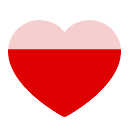
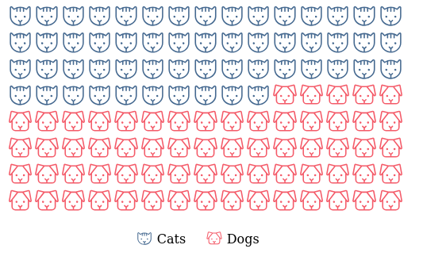

<!-- README.md is generated from README.Rmd. Please edit that file -->

```{r, include = FALSE}
knitr::opts_chunk$set(
  collapse = TRUE,
  comment = "#>",
  fig.path = "man/figures/README-",
  out.width = "100%"
)
library(phosphoricons)
cat(as.character(ph("lightning", weight = "thin", height = "256px", width = "256px")), file = "man/figures/lightning-thin.svg")
cat(as.character(ph("lightning", weight = "light", height = "256px", width = "256px")), file = "man/figures/lightning-light.svg")
cat(as.character(ph("lightning", weight = "regular", height = "256px", width = "256px")), file = "man/figures/lightning-regular.svg")
cat(as.character(ph("lightning", weight = "bold", height = "256px", width = "256px")), file = "man/figures/lightning-bold.svg")
cat(as.character(ph("lightning", weight = "fill", height = "256px", width = "256px")), file = "man/figures/lightning-fill.svg")
cat(as.character(ph("lightning", weight = "bold", fill = "gold", height = "256px", width = "256px")), file = "man/figures/lightning-bold-gold.svg")
```

# phosphoricons

<!-- badges: start -->
<!-- badges: end -->

R wrapper for using [Phosphor Icons](https://github.com/phosphor-icons/phosphor-icons) in shiny applications or rmarkdown documents. Visit [phosphoricons.com](https://phosphoricons.com/) for a list of all available icons.

## Installation

You can install {phosphoricons} from GitHub with:

```r
remotes::install_github("dreamRs/phosphoricons")
```


## Icons usage

Create an icon with `ph()` function:

```{r basic, eval=FALSE}
library(phosphoricons)
ph("lightning")
```
{height=32}


There's 5 weights available:

```{r type-thin, eval=FALSE}
ph("lightning", weight = "thin")
```
{height=32}
```{r type-light, eval=FALSE}
ph("lightning", weight = "light")
```
{height=32}
```{r type-regular, eval=FALSE}
ph("lightning", weight = "regular")
```
{height=32}
```{r type-bold, eval=FALSE}
ph("lightning", weight = "bold")
```
{height=32}
```{r type-fill, eval=FALSE}
ph("lightning", weight = "fill")
```
{height=32}

Colorize icon using `fill` argument:

```{r color-icon, eval=FALSE}
ph("lightning", weight = "bold", fill = "gold")
```
{height=32}


## Bonus

Fill icon according to percentage:

```{r icon-fill-perc-1, eval=FALSE}
ph_fill(
  ph("heart", weight = "fill", height = 128),
  colors = c("#DF0101", "#F6CECE"),
  breaks = 0.7
)
```

```{r icon-fill-perc-1b, echo=FALSE}
icon <- ph_fill(
  ph("heart", weight = "fill", height = "256px", width = "256px"),
  colors = c("#DF0101", "#F6CECE"),
  breaks = 0.7
)
cat(as.character(icon), file = "man/figures/icon-fill-perc-1.svg")
```
{height=128}


```{r icon-fill-perc-2, eval=FALSE}
ph_fill(
  ph("star", weight = "fill", height = 128, stroke = "gold", `stroke-width` = 10),
  colors = c("gold", "#FFF"),
  breaks = 0.5,
  orientation = "h"
)
```

```{r icon-fill-perc-2b, echo=FALSE}
icon <- ph_fill(
  ph("star", weight = "fill", height = "256px", width = "256px", stroke = "gold", `stroke-width` = 10),
  colors = c("gold", "#FFF"),
  breaks = 0.5,
  orientation = "h"
)
cat(as.character(icon), file = "man/figures/icon-fill-perc-2.svg")
```
{height=128}


Icon waffle:

```{r waffle, eval=FALSE}
waffle_icon(
  values = sample(c("Cats", "Dogs"), 200, TRUE),
  colors = list(
    Cats = "#456990",
    Dogs = "#F45B69"
  ),
  icons = list(
    Cats = ph("cat", height = NULL),
    Dogs = ph("dog", height = NULL)
  ),
  ncol = 15,
  nrow = 8,
  width = "500px"
)
```



