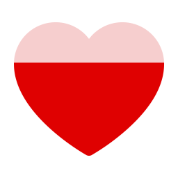
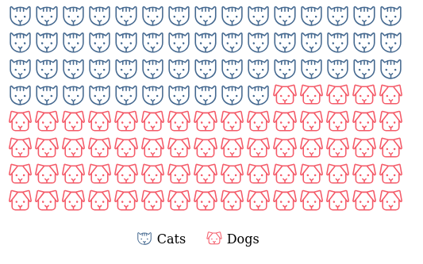

<!-- README.md is generated from README.Rmd. Please edit that file -->

# phosphoricons

<!-- badges: start -->

[](https://CRAN.R-project.org/package=phosphoricons)
[](https://cran.r-project.org/package=phosphoricons)
[](https://app.codecov.io/gh/dreamRs/phosphoricons?branch=master)
[](https://github.com/dreamRs/phosphoricons/actions/workflows/R-CMD-check.yaml)
<!-- badges: end -->

R wrapper for using [Phosphor
Icons](https://github.com/phosphor-icons/web) in shiny applications or
rmarkdown documents. Visit
[phosphoricons.com](https://phosphoricons.com/) for a list of all
available icons.

## Installation

Install from CRAN with:

``` r
install.packages("phosphoricons")
```

You can install development version from GitHub with:

``` r
remotes::install_github("dreamRs/phosphoricons")
```

## Icons usage

Create an icon with `ph()` function:

``` r
library(phosphoricons)
ph("lightning")
```


There’s 5 weights available:

``` r
ph("lightning", weight = "thin")
```


``` r
ph("lightning", weight = "light")
```


``` r
ph("lightning", weight = "regular")
```


``` r
ph("lightning", weight = "bold")
```


``` r
ph("lightning", weight = "fill")
```


Colorize icon using `fill` argument:

``` r
ph("lightning", weight = "bold", fill = "gold")
```


There’s two type of icons:

- SVG icons, created with `ph()`
- Font icons, created with `ph_i()`

There’s a big debate between Web Fonts vs SVG for icons, but mainly:

- Web fonts require an `htmlDependency` that include all icons even if
  you use one, it will increase the size of your document in self
  contained mode.
- SVG icons won’t currently work with some shiny functions with an
  `icon` argument.

## Bonus

Fill icon according to percentage:

``` r
ph_fill(
  ph("heart", weight = "fill", height = 128),
  colors = c("#DF0101", "#F6CECE"),
  breaks = 0.7
)
```



``` r
ph_fill(
  ph("star", weight = "fill", height = 128, stroke = "gold", `stroke-width` = 10),
  colors = c("gold", "#FFF"),
  breaks = 0.5,
  orientation = "h"
)
```


Icon waffle:

``` r
waffle_icon(
  values = sample(c("Cats", "Dogs"), 200, TRUE),
  colors = list(
    Cats = "#456990",
    Dogs = "#F45B69"
  ),
  icons = list(
    Cats = ph("cat", height = NULL),
    Dogs = ph("dog", height = NULL)
  ),
  ncol = 15,
  nrow = 8,
  width = "500px"
)
```


